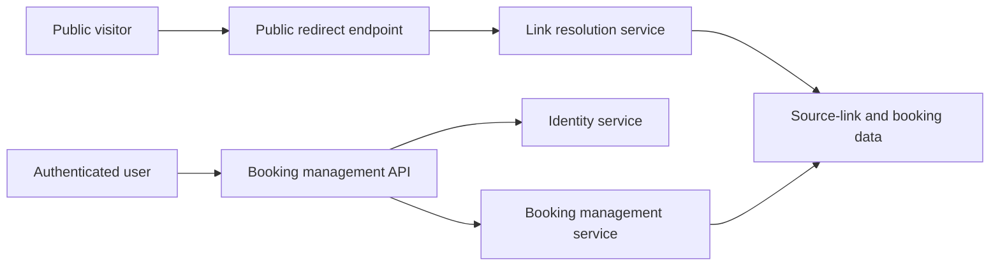

# Overall Architecture Design Version 2
## 1. Purpose
Essense Gadget - Shorten URL Service (PRD-04) version 2 evolves the existing URL shortener into a link-routing service.

The service provide stable public links that redirect visitors to a destination URL. A link normally redirects to its default target, but an authenticated user can reserve that link for a specific time window and temporarily redirect it to another target.

The upgrade preserves the existing URL-shortener experience for public users and the current web frontend.

## 2. Scope

Version 2.0 supports:
- Public access to shortened links without authentication.
- Existing short-link creation behavior for current frontend users.
- A default target destination for each public link.
- Authenticated users creating and managing bookings for a link.
- Time-based destination resolution.
- Automatic fallback to the default target when no valid booking applies.

The service does not own identity lifecycle, DNS, TLS certificate or availability of the website.

## 3. Product Evolution
PRD-04 Version 2 replaces the separate [PRD-002 booking service initiative](https://github.com/0x1115-inc/prd-002). The booking capability is an extension of link routing.

- PRD-04 Version 1: Public short-link creation and point to a fixed target.
- PRD-04 Version 2: Introduces link booking and time-based destination resolution while maintaining backward compatibility with Version 1.

The legacy anonymous short-link creation endpoint remains available for the existing frontend. Internally, new APIs may use a more structured link-management endpoint without forcing an immediate frontend migration.

## 4. Core Concept
### 4.1 Source Link
A source link is a stable public URL used by visitors. Examples:
```text
https://short.example.com/abc123
https://short.example.com/xyz789
```

Each source link has:
- A public identifier.
- A default target destination URL.
- Optional booking windows.
- A lifecycle state such as enabled or disabled.

Version 2.0 may begin with one bookable link, but the architecture treats each source link independently so multiple links can be supported later on.

### 4.2 Booking
A booking temporarily associates a source link with a different target destination. A booking contains:
- The source link it applies to.
- The temporary target destination URL.
- A start time and end time.
- A lifecycle state, such as scheduled or canceled.
- The authenticated user who made the change.

Bookings for the same source link must not overlap. Booking for different source links may occur during the same time period.

### 4.3 Default Target
Every source link has a default target. This target is used whenever no active booking applies.

## 5. Logical Architecture


## 6. Responsibility
### 6.1 Public Redirect Endpoint
The public redirect endpoint receives requests for source links and returns a redirect response.

It is responsible for:
- Identifying the requested public link.
- Resolving its applicable target destination.
- Redirecting the visitor.
- Returning an appropriate not-found response for unknown links.

Public redirect access remains unauthenticated.

### 6.2 Link Resolution Service
The link resolution service determines the destination of a source link. It follows the rules:
1. Identify the source link.
2. Check for an active and valid booking at the current UTC time.
3. Use a booking target if one applies.
4. Otherwise, use the source link's default target.

For a known link: 
$$
destination(link, t) =
\begin{cases}
booking.target & \text{when an active booking applies at } t \\
link.defaultTarget & \text{otherwise}
\end{cases}
$$

Booking periods are evaluated at request time. The system does not depend on scheduled background jobs to active or expire bookings.

### 6.3 Booking Management Service
The booking management service enables authenticated users to:
- View bookings.
- Create bookings.
- Update bookings.
- Cancel bookings.

It validates booking times and ensures bookings do not conflict for the same source link.

Version 2.0 limits access based on authentication. Fine-grained feature authorization is deferred to a later version.

### 6.4 Data Layer
The data layer maintains:
- Source-link configuration.
- Default targets.
- Booking schedules.
- Booking status.

It must preserve the rule that conflicting active bookings cannot exist for the same source link.

## 7. Resolution Behavior
The service must fall back to the default target when a known source link has no usable active booking.

This includes bookings that are:
- Outside their time window.
- Canceled.
- Invalid or unavailable for resolution.

An unknown public link has no configured default target and returns a not-found response.

## 8. Version Boundaries
### 8.1. Version 2.0: Booking Foundation
- Generalize the existing short-link model as `SourceLink`.
- Preserve public link and existing frontend compatibility.
- Add authenticated booking management.
- Add time-based destination selection.
- Fall back to the default target when no booking applies.
- Support one initial bookable source link while retaining a model that supports many.
- Source links have one nullable owner. Owners can transfer ownership.
- Source links are never deleted. When unowned, they are hidden form user management but remain publicly routable according to their status and configured default target.
- Owners manage source links and all bookings associated with them. "Manager" means the source link owner in v2.0.
- Bookings can be edited at any lifecycle stage, including an active window. Changes take effect on subsequent redirect requests after overlap validation.
- Source-link creation is unlimited in v2.0, while the service isolates quota checks behind a future policy mechanism.
- Booking time values are stored and exchanged as UTC. The browswer display and accepts user-local times, converting them to UTC at the API boundary.
- Source links use a globally unique, user-defined `path`, not only a generated slug.
- The source path use the allowed character set `[a-z0-9\-_\/]`, with normalization/edge-case rules documented separately.

### 8.2. Version 2.1: Operational Capabilities
- Add tracking link capabilities such as counting clicks, recording referrers, and tracking user interactions.
- Add audit logging for link and booking changes.
- Add structured logs, metrics, traces, and health checks.
- Add operational documentation and monitoring as required.

### 8.3. Version 2.2: Feature Authorization
- Introduce feature-based authorization for authenticated users.
- Define permissions for booking and source-link operations.
- Add additional management features as product requirements mature.

## 9. References
- [Link Booking Service Initiative](https://github.com/0x1115-inc/prd-002)

## 10. Document Control
| Document Version | Date | Author | Description |
|------------------|------|--------|-------------|
| 1.0.1     | 2026-09-12 | Duog Lee <duog.lee@0x1115.com> | Initialize document with overall design and architecture details. |
| 1.0.1   | 2026-09-13 | Duog Lee <duog.lee@0x1115.com> | Update document version to reflect minor edits and clarifications. |
